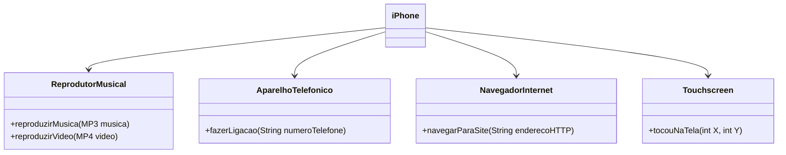

Diagrama UML do primeiro Iphone

```mermaid
    classDiagram
    class iPhone {
    }

    class ReprodutorMusical {
        +reproduzirMusica(MP3 musica)
        +reproduzirVideo(MP4 video)
    }

    class AparelhoTelefonico {
        +fazerLigacao(String numeroTelefone)
    }

    class NavegadorInternet {
        +navegarParaSite(String enderecoHTTP)
    }

    class Touchscreen {
        +tocouNaTela(int X, int Y)
    }

    iPhone --> ReprodutorMusical
    iPhone --> AparelhoTelefonico
    iPhone --> NavegadorInternet
    iPhone --> Touchscreen
```